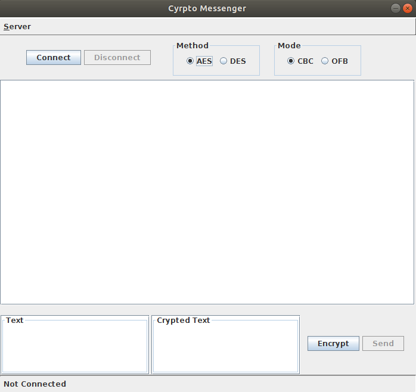
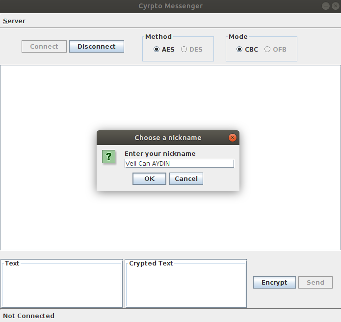
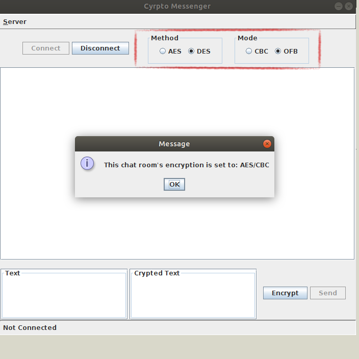
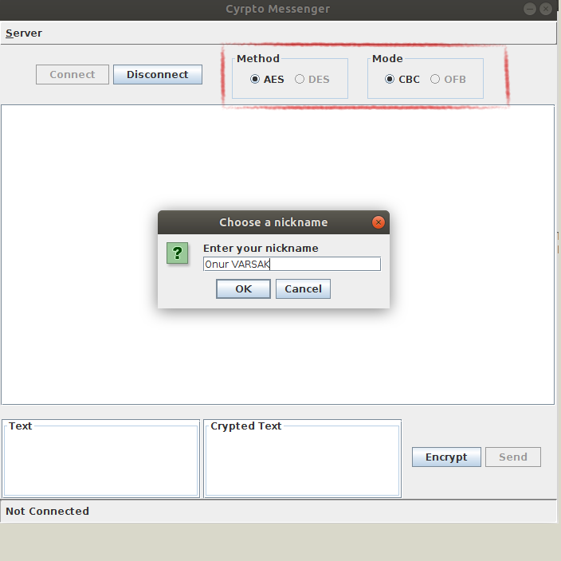
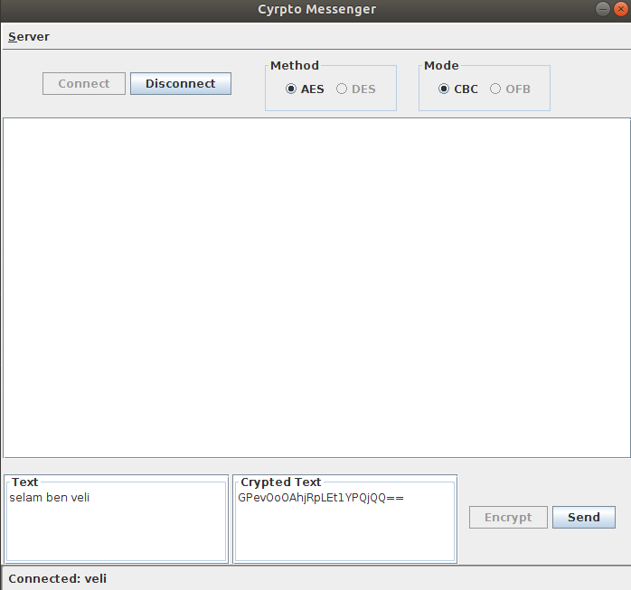
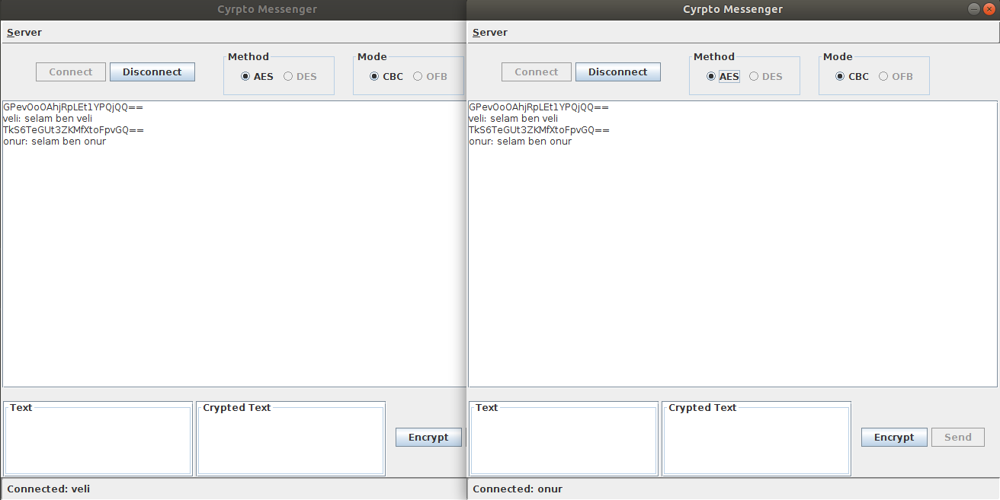

# AES-DES-Messenger  

#### Created with https://github.com/onurvarsak
## Software Usage  
We need to run Server and Client files in order to use this program.    
First compile files:  
javac Server.java javac Client.java  
Then, run files:  
java Server(just once) java Client(for each client)  
## Software Design  
#### Graphical User Interface (GUI)  
We designed our interface elements component by component using Java Swing library.
For each panel and area in GUI, there is at least one associated class in our source files.
By declaring our components, we achieved to manipulate each component according to
our design and reduced code complexity. Our program consists of these GUI components: 

Plain buttons, radio buttons, labels, scroll bars, option panels and text areas.
When first program is opened, connect button is selectable and all other components
such as text areas are disabled.  

  

If connecting user is the first user who connects to the server, he/she can select encryp-
tion method and mode. After pressing connect button, he/she has to choose a unique
username in order to communicate in the chat room.  

  

After a successful login, one can write messages that other clients can read, and read
other clients’ messages.  

If connecting user is not the first client, then his/her choice of method and mode is
ignored and user is alerted with a warning message. In this way, one doesn’t need to
know encryption method and mode specifically to read messages. Automatically those
modes are selected and user is connected to the server.  

    
#### Back-end  

On server-side, there is no server object, in Server’s main() method, a while loop is
running, if there is a connection request coming to the server’s socket listener, then
a Handler object is created. Handler is a private class in Server class and it extends
Thread class. In this way, communication can be done in parallel, each client-server link
is accomplished by a thread that runs until client disconnects or server shuts down.    

Client messages are carried along message queues. Each client has its own read and
write queue. If a user writes a messages, then this message first written into its own
write queue, it sends this message to server. On server-side, this message is written into
other clients’ read queues.    

Our program uses end-to-end encryption which means server can not know what’s the
message. It knows the encryption method and mode but since it does not have the key,
it can not decrypt messages between clients.    

Besides these design issues, there are some unique message prefixes to determine some
certain information about user. When a user is attempting to connect to the server,
first message that comes to the server is username and it’s determined with the ”USER-
NAME” prefix. This username is checked by looking all client names, if it’s legit, then
user can have access to the chat room and write messages. This access is determined by
”NAMEOK” prefix.    

If connecting user is the first client, then its write queue writes two specific messages
to the server: ”METHOD” and ”MODE”. These two prefixed messages determines the
encryption. When another client is connected to the server these messages are written
into their read queue, so each client knows what’s the encryption mode and method to
perform encryption and decryption.    

To eliminate privacy concerns, we decided to have hard-coded initialization vector and
key in our encryption class. So that, server does not contain key information and any
attacker to the server can not get any message regarding key information.    
## Screenshots  
  
  

